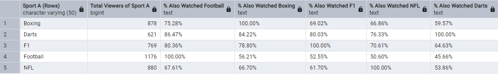

# Cross-Sport Fan Engagement Analysis (Simulated Data Case Study)

Analyzed simulated viewership data to quantify the overlap between fans of different major sports (Football, Boxing, F1, NFL, etc.) and inform cross-promotional strategies.

## SQL Techniques Utilized

The core analysis relied heavily on **SQL (PostgreSQL)**, employing techniques such as:

*   **JOINs (`INNER`, `LEFT`):** To combine user viewing logs with event and demographic data.
*   **Common Table Expressions (CTEs):** To structure the multi-step overlap calculation logically.
*   **Aggregate Functions (`COUNT(DISTINCT ...)`):** To accurately count unique viewers per sport.
*   **Conditional Aggregation (`FILTER` clause):** To efficiently build the overlap matrix by counting users watching specific sport pairs within a single aggregation.
*   **Data Type Casting & Formatting:** To ensure accurate percentage calculations (`CAST`, `ROUND`, `NULLIF`).

*See `SQL_data_analysis/02_analysis_queries.sql` for the detailed implementation.*

## Key Finding: Cross-Sport Overlap Matrix

The analysis generated an overlap matrix showing the % of viewers for `Sport A` (Rows) who also watched `Sport B` (Columns).

*(Note: Percentages are illustrative based on one simulation run.)*

 

**Insights:**

*   Strong **Football-F1** viewership link (~50-60%).
*   **Boxing** shows broad appeal, overlapping significantly with NFL (~60%) and Football (~75%) viewers.
*   Overlap varies across pairings, indicating both distinct preferences and multi-sport engagement opportunities.

## Recommendations

*   **Target High-Overlap Segments:** Promote Football content heavily to F1 viewers.
*   **Leverage Bridge Sports:** Use Boxing for broad campaigns targeting NFL/Football fans.
*   **Inform Personalization:** Use overlap data to enhance content recommendations.
*   **Explore Bundles:** Consider packaging high-overlap sports.

## Tech Stack

*   **Database & Analysis:** PostgreSQL (SQL)
*   **Visualization:** SQL Query Output

## How to View/Reproduce

*   **Results:** See the matrix screenshot above.
*   **Analysis:** Review scripts in the `SQL_data_analysis/` directory.
*   **Run:** Execute SQL scripts against a PostgreSQL database populated with simulated data.

## Data Note

Analysis uses **simulated** data. See `Data_files/` for samples.
